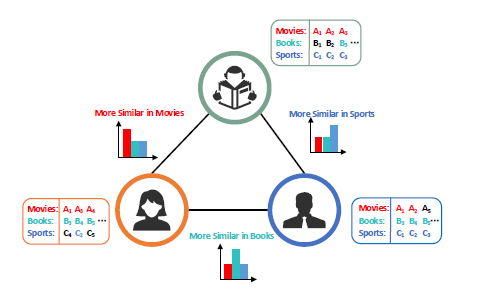
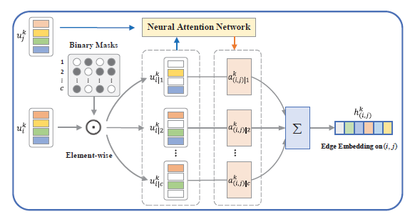

# An End-to-End Framework for Learning Multiple Conditional Network Representations of Social Network

提出了一个用于学习多个条件网络表示的端到端的框架MCNE。首先设计了一个二值遮罩层，用于将单个向量分割为多个维度的条件嵌入部分，然后使用一个注意力网络来建模不同偏好之间的交互关系，并使用一个修改后的图神经网络的消息发送和接受操作，所以可以捕捉到高阶邻居信息。最后使用贝叶斯个性化排名损失函数学习每种维度的偏好相似度，并通过多任务学习框架交叉学习多个条件结点嵌入。

## Motivation

目前的网络表示学习方法都是为结点学习一个单独的嵌入向量，因此就只能表示一种关系的强弱，但是在比如社交网络的许多种网络中，节点之间经常会存在多种角度的相似程度，比如在上面这个网络中，女人和孩子在电影维度上具有相似性，而和男人在书这个维度上相似性更强。因此需要使用多个向量来表示节点间不同维度的相似性。

## Problem Definition

**社交网络（social network）**：社交网络是一个二元组$G=(V,E)$，每条边$e_{i,j}\in E$都有一个权重$w_{ij}$表示两个用户之间的关系的强度。

**多类型用户行为（Mult-category User Behavior）**：给定用户$V$和行为类别$c$的项目$I_c$，使用一个矩阵$R_c\in\mathbb{R}^{|N|\times|M_c|}$表示在类别$c$中的项目的记录信息，如果用户$i$出现过项目$j$，那么$R_{ij|c}=1$，否则就是$0$。最后我们使用一个矩阵集合$S_R=\{R_1,...,R_C\}$来表示所有类别下的行为矩阵。

**多类型条件网络表示**：给定一个网络$G=(V,E)$和一个多类型行为矩阵$S_R=\{R_1,...,R_C\}$，目标是为每个用户在多类型行为上同时学习一个低维条件向量表示集合$S_U=\{U_1,..,U_C\}$。同时每个条件向量$U_c\in\mathbb{R}^{|V|\times d}(d\ll|V|)$表示可以满足一下特性：

1. 条件向量表示应当保存网络结构信息
2. 条件向量表示应当保存用户间在类型c上的相似程度

## Model: MCNE

整个模型流程在introduction中说明，一共分为三个部分，分别是生成多个条件网络表示，学习用户在特定行为上的偏好相似度以及交叉学习多个用户偏好

### 生成多个条件网络表示

#### embedding layer

首先将网络中的结点映射到一个低维向量空间中，使用$U^0\in\mathbb{R}^{|V|\times d_0}$表示原始的节点表征。

#### 二值遮罩层

将$U^0$视作第0层的图神经网络的嵌入层。使用一个二值遮罩层来将每层的节点表征划分成不同的向量子空间。每一层都要经过一个实值的权重矩阵$M_r^k\in\mathbb{R}^{|C+1|\times d_k}$，并使用额外的维度表示其他没有包含在训练数据集中的用户行为偏好。最后通过一个硬阈值函数
$$
M_{b_{ij}}^k=\left\{
    \begin{aligned}
    1,& & if  M_{r_{ij}}^k\ge 0&\\
    0,& & otherwise
    \end{aligned}
    \right.
$$
得到二值遮罩矩阵$M_b^k$。
所以用户$i$在第$c$类上的条件网络表征可以定义为
$$
u_{i|c}^k=u_i^k\odot m_c^k
$$

也就是只保留表征向量中$c$类维度上的值，其他的值都归$0$。

#### 多维度相似度消息发送操作

在二值遮罩层得到了节点的多维条件表示之后，使用图神经网络的消息发送和接受算子得到下一层的节点嵌入向量。由节点$v_i$在边$e_{i,j}$上传播的多维度相似性信息定义为不同行为类的条件网络表征的加权和，即
$$
v\rightarrow e:h_{(i,j)}^k=\sum_{c=1}^{|C|+1}a_{(i,j)|c}^k\bullet u_{i|c}^k
$$
，其中$a_{(i,j)|c}^k$是不同类对应的权重。

为了计算这个权重，使用一个注意力网络

$$
a_{(i,j)|c}^{k'}=\mathbf{h}^{k^T}ReLU(\mathbf{W_a^k[u_{i|c}^k,u_{j|c}^k]})
$$
，使用一对节点的条件表征作为输入，然后通过一个多层神经网络得到对应的权重值，并最终通过softmax函数进行归一化。$c$类的权重越大，条件表征的信息越可能通过边$e_{i,j}$传递到下一层。

#### 多维度相似性消息接收操作

使用多维度相似性消息接收操作更新下一层的嵌入向量。对网络中的每个结点$v_i$，接收操作定义为
$$
e\rightarrow v:\left\{
    \begin{aligned}
    h_{\mathcal{N}(i)}^{k+1}=AGGR(\{h_{(i,j)}^k,\forall j\in \mathcal{N}(i)\})\\
    u_i^{k+1}=ACT(\mathbf{W}^{k+1}[h_{N(i)}^{k+1},u_i^k])
    \end{aligned}
    \right.
$$
$AGGR$是average pooling操作，用于将节点邻居的多维度相似度聚合为单一向量。得到邻居结点的聚合向量后，再合并当前的节点向量和聚合向量，并通过一个使用非线性激活函数$ACT(x)=max(0,x)$的全连接层得到新一层的节点嵌入向量。

#### 最终的多维度条件网络表征

堆叠多层向量（stack $k$ layers）*怎么个意思？不懂*，并使用二值遮罩层得到多个条件网络表征。

### 条件网络表征的交叉学习
